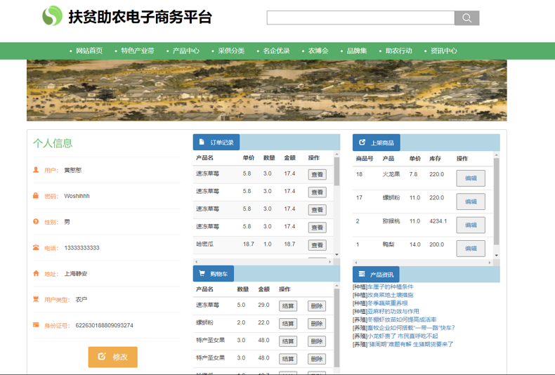
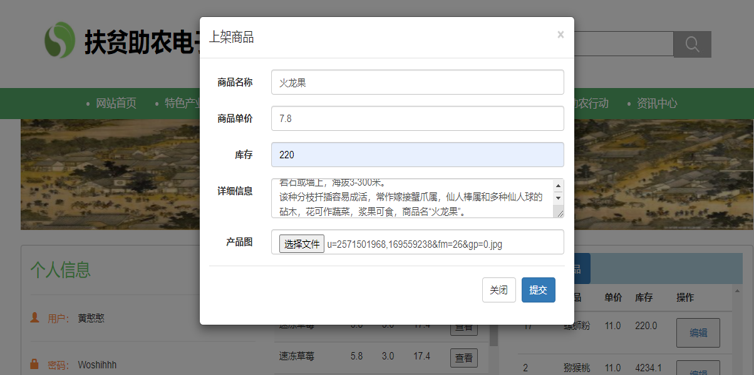
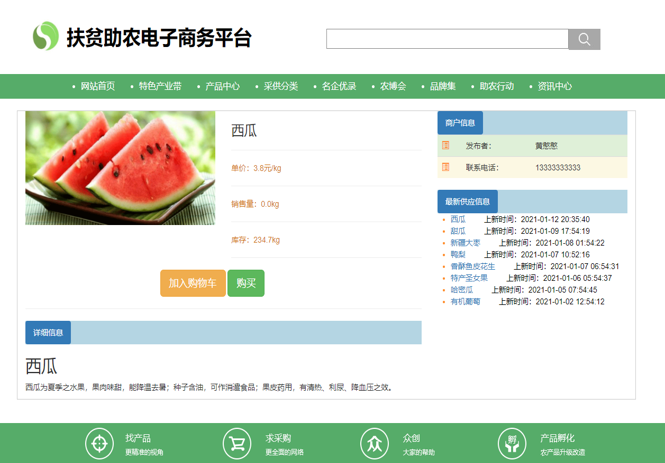
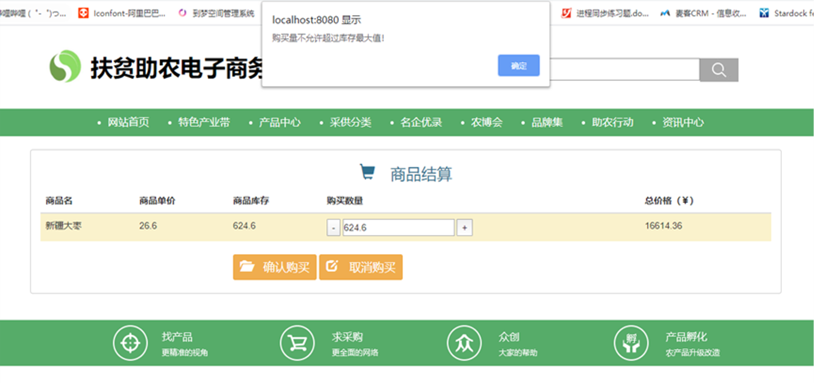
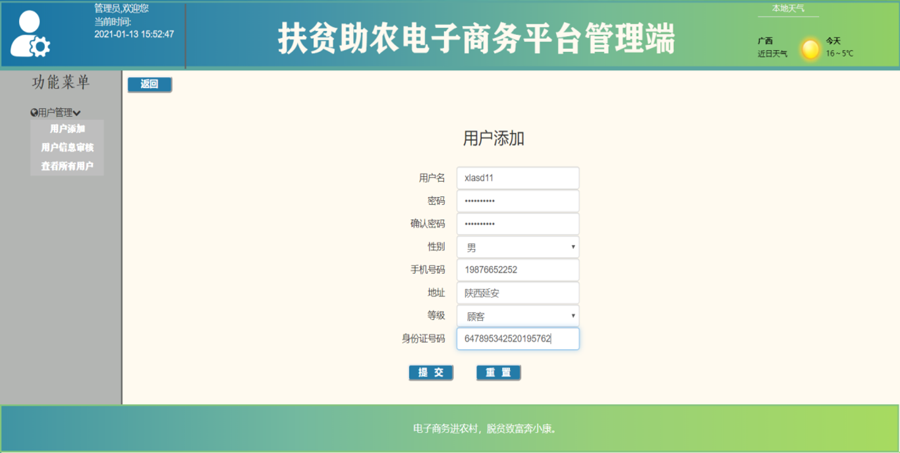

# 扶贫助农电子商务平台

此处以图片形式展示网站部分功能，并介绍一些核心流程

## 目录

[0.使用Redis优化的Jwt令牌控制用户登录](#0.使用Redis优化的Jwt令牌控制用户登录)

[1.网站首页](#1.网站首页)

[2.特色产业带](#2.特色产业带)

[3.产品中心](#3.产品中心)

[4.采供分类](#4.采供分类)

[5.名企优录](#5.名企优录)

[6.个人中心](#6.个人中心)

[7.上架产品](#7.上架产品)

[8.商品详情](#8.商品详情)

[9.商品结算](#9.商品结算)

[10.管理端](#10.管理端)

## 0. 使用Redis优化的Jwt令牌控制用户登录

### 0.0 Jwt令牌使用

能够保证用户在未登录的情况下不能够访问部分资源。这里可以通过令牌来实现。

此处使用Jwt令牌，首先定义工具类

```java
public class JwtUtil{
    private static final String KEY = "itheima";

    //接收业务数据，生成token并返回
    public static string genToken(Map<String,0bject> claims){
        return JWT.create()
            .withClaim( name:"claims"，claims)
            .withExpiresAt(new Date(System.currentTimeMillis()+1000*60*60 *12))
            .sign(Algorithm.HMAC256(KEY)); 
    }

    //接收token,验证token，并返回业务数据
    public static Map<String,0bject> parseToken(String token){
        return JWT.require(Algorithm.HMAC256(KEY))
            .build()
            .verify(token)
            .getClaim( s:"claims")
            .asMap();
    }
}
```

令牌验证的三种失败情况：

- 如果篡改了头部和载荷部分的数据，那么验证失败

- 如果秘钥改了，验证失败

- token过期

设置和注册拦截器：

```java
// 拦截器
@Component
public class LoginInterceptor implements HandlerInterceptor{
    @Override
    public boolean preHandle(HttpServletRequest request, HttpServletResponse response, Object handler) throwsException {
        // 令牌验证，存在请求头的Authorization中
        String token = request.getHeader("Authorization");
        // 验证token
        try {
            Map<String,Object> claims = JwtUtil.parseToken(token);
            // true表示不拦截，放行
            return true;
        } catch(Exception e) {
            // 设置401响应
            response.setStatus(401);
            // false表示不拦截，不放行
            return false;
        }
    }
}
// 拦截器注册
@Configuration
public class WebConfig implements WebMvcConfigurer{
    @Autowired
    private LoginInterceptor loginInterceptor;
    //注册拦截器
    @Override
    public void addInterceptors(InterceptorReqistry registry){
        // 目前是拦截所有的请求，设置不拦截的路径（登录、注册不拦截）
        registry.addInterceptor(loginInterceptor).excludePathPatterns("/user/login","/user/register");
    }
}
```

通过拦截器，访问进入程序内部的流程为：**用户请求→拦截器→通过则可访问相应资源**

### 0.1 使用Redis优化

如果用户在登录后（获得了一个令牌），修改了密码，此时原本的令牌仍然没有失效，仍然是可用的，这就会导致非法访问的问题，为了对这个登录进行优化，这里使用Redis进行登录优化：

- 登录的时候，将令牌拷贝一份存入到`redis`中

- 检查用户合法性时，除了检查用户的令牌合法，还要比较当前令牌与redis中的令牌是否一致，一致则认为是已登录状态，否则是未登录状态

- 在用户修改密码后，删除掉redis中对应的令牌即可

```java
// 登录时从redis里面拿出对应的token，和当前用户传入的token进行比较
@Autowired
private StringRedisTemplate stringRedisTemplate;

@PostMapping("/login")
public Result<String> login(@Pattern(regexp = "^\\S{5,16}$") String username, @Pattern(regexp = "^\\S{5,16}$") String password){
    ...
    boolean passwordValidation = Md5Util.checkPassword(password, user.getPassword());
    if (passwordValidation){
        Map<String, Object> claims= new HashMap<String, Object>();
        claims.put("id", user.getId());
        claims.put("username", user.getUsername());
        String jwtData = JwtUtil.genToken(claims);
//        令牌存储到redis中
        ValueOperations<String, String> stringStringValueOperations = stringRedisTemplate.opsForValue();
//        Redis令牌过期时间和JwtUtil中保持一致
        stringStringValueOperations.set(user.getUsername(), jwtData, 12, TimeUnit.HOURS);
        return Result.success(jwtData);
    } else {
        return Result.error("密码错误");
    }
 }
```

```java
// 拦截器更新
@Override
public boolean preHandle(HttpServletRequest request, HttpServletResponse response, Object handler) throws Exception {
//    获得token
    String token = request.getHeader("Authorization");
//    验证token
    try{
        Map<String, Object> claims = JwtUtil.parseToken(token);

        String username = (String) claims.get("username");
        ValueOperations<String, String> stringStringValueOperations = stringRedisTemplate.opsForValue();
        String token_in_redis = stringStringValueOperations.get(username);

        if (token_in_redis == null || !token_in_redis.equals(token)){
            throw new RuntimeException("登录令牌验证失败");
        }

        ThreadLocalUtil.set(claims);
        return true;
    } catch (Exception e){
        response.setStatus(401);
        return false;
    }
}
```

```java
// 用户更新密码删除令牌
@PatchMapping("/updatePassword")
public Result updatePassword(@RequestBody Map<String, String> params){
    String oldPwd = params.get("old_pwd");
    String newPwd = params.get("new_pwd");
    String rePwd = params.get("re_pwd");

    if (oldPwd.isEmpty() || newPwd.isEmpty() || rePwd.isEmpty())
        return Result.error("输入内容不能为空！");

    if (!newPwd.equals(rePwd))
        return Result.error("两次输入的密码不一致");

    Map<String, Object> claims = ThreadLocalUtil.get();
    String username = (String) claims.get("username");
    User user = userService.findByUsername(username);
    if (!Md5Util.checkPassword(oldPwd, user.getPassword()))
        return Result.error("原密码输入错误");

    userService.updatePassword(newPwd, user.getId());
//    删除Redis中对应的token
    ValueOperations<String, String> stringStringValueOperations = stringRedisTemplate.opsForValue();
    stringStringValueOperations.getOperations().delete(user.getUsername());

    return Result.success();
}
```

## 1. 网站首页


## 2. 特色产业带


## 3. 产品中心


## 4. 采供分类


## 5. 名企优录


## 6. 个人中心

主要是修改自己的个人信息、查看购物车、查看订单记录。

农户比普通用户额外多一个上架商品的列表



## 7. 上架商品（仅限农户角色）

上架单品需在进行身份认证后上架（见第10点），上架单品时需要指定商品名称、单价、库存、详细信息，并给定产品代表图片



## 8. 商品详情

展示商品的图片、单价、发布者、介绍信息



## 9. 商品结算

商品结算主要是选购买的数量，并进行确认购买



## 10. 管理端

管理端主要是添加用户、审核农户的身份信息（农户需要传身份证才能够上架商品）

管理端页面：



身份证上传页面：


